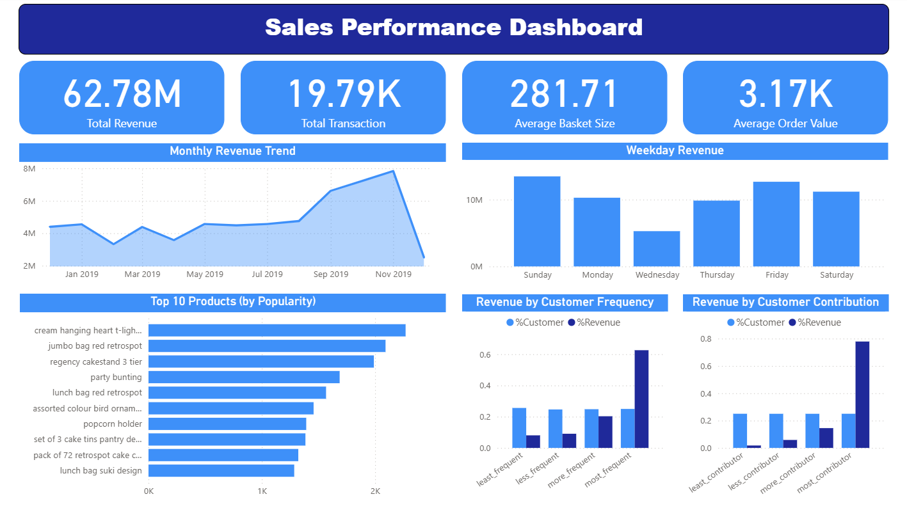

# Sales Analytics Dashboard Portfolio

## Project Overview
This project demonstrates an end-to-end data analytics workflow using **Python, SQL, and Power BI**. The goal is to clean, transform, and analyze sales transaction data, and create a dashboard for business insights.

**Stakeholders questions based on data source (Kaggle)**

1. How was the sales trend over the months?

2. What are the most frequently purchased products?

3. How many products does the customer purchase in each transaction?

4. What are the most profitable segment customers?

5. Based on your findings, what strategy could you recommend to the business to gain more profit?
   

- **Data Source:** Kaggle - Online Retail dataset (https://www.kaggle.com/datasets/gabrielramos87/an-online-shop-business)
- Notebooks: [analysis.ipynb](notebooks/analysis.ipynb), [sql_validation.ipynb](notebooks/sql_validation.ipynb)
- **Tools Used:** Python (`pandas`, `numpy`, `matplotlib`), PostgreSQL / Azure SQL, Power BI
  

---

## Data Cleaning & Feature Engineering (Python)
- Loaded raw transaction data into a Pandas DataFrame.
- Created cleaned columns and engineered features:
  - `revenue = price * quantity`
  - `abs_quantity = absolute value of quantity`
  - `no_C_transaction_num = transaction number without “C”`
  - Standardized `product_name` (lowercase, trimmed spaces)
- Derived temporal features: `day_name`, `month`, `year`, `year_month_dt`, `year_month_str`
- Created customer segments using quantile-based categorization:
  - `customer_frequency` (least → most frequent)
  - `customer_contribution` (least → most contributing)
- Categorized products by price and volume using `qcut`.
- Exported the cleaned DataFrame to Azure PostgreSQL.

---

## SQL Workflow

**SQL Validation Checks**  
  - Using SQL, the dataset was validated for key quality metrics including:
    - Column names and data types
    - Total row count
    - Null values per column
    - Duplicate rows (exact duplicates across all columns)
    - A reusable Python function (`run_query`) was used to execute SQL queries and return results as DataFrames, making the workflow reproducible and clean.

**Note:** 
- While in production environments, SQL validation often occurs first, this workflow emphasizes reproducibility, clarity, and showcases proficiency across multiple tools — Python for EDA, SQL for validation, and Power BI for reporting.

- Developed SQL views to pre-aggregate KPIs and metrics for Power BI:
  - `view_total_revenue` → Total Revenue
  - `view_avg_product_per_transaction` → Average Product Per Transaction
  - `view_total_order_value` → Average Order Value
  - `view_total_transaction` → Total Transactions
  - `view_top_product` → Top-selling product By Revenue
  - `view_customer_vs_revenue_by_frequency` → % Revenue vs % Customers per frequency segment
  - `view_customer_vs_revenue_by_contribution` → % Revenue vs % Customers per contribution segment
  - `view_monthly_revenue` → Monthly Revenue
  - `view_top_10_products` → Top 10 Products by Revenue
  - `view_weekday_sales` → Weekday Sales

- Views are pre-aggregated per metric for efficient reporting.
- Views can be refreshed to reflect updated data in Power BI.

---

## Power BI Dashboard
- Connected to SQL views and fact table.
- Created KPI cards and charts:
  - Total Revenue, Avg Product Per Transaction, Avg Order Value, Total Transactions, Top Product
  - Monthly Revenue Trend
  - Weekday Sales
  - Top 10 Products by Revenue
  - Segment % Revenue and % Customers by Customer Frequency
  - Segment % Revenue and % Customers by Customer Contribution
- **Interactivity:**
  - KPI cards update automatically on SQL refresh.
  - Charts are interactive (slicers and filters) when using the full fact table.
    


---

## Recommendations / Findings
- Transactions concentrated in **UK (~91%)**; peak revenue in **September**.
- Top 25% frequent customers generate ~63% of revenue; top contributors generate ~78%.
- Popular products may not be the most profitable — opportunity for bundling with higher-margin products.
- Midweek sales slump (Wednesdays) — opportunity for flash promotions.
- International growth potential outside the UK.

---

## Folder Structure

```
e-commerce-data-analysis/
├── dashboards/             # Power BI files
├── notebooks/              # Python analysis & SQL Validation check
├── raw_data/kaggle_data    # CSV datasets
├── sql/                    # SQL scripts
├── gitignore
└── requirements.txt
```


